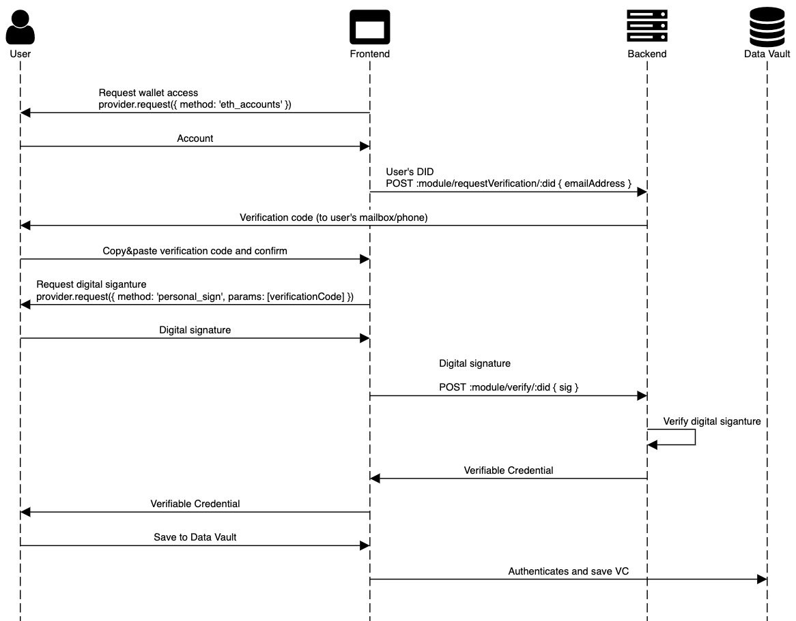

<p align="middle">
    
</p>
<h3 align="middle"><code>vc-issuer</code></h3>
<p align="middle">
    Verifiable Credential issuer
</p>

<p align="middle">
  <a href="https://github.com/rsksmart/email-vc-issuer/actions?query=workflow%3Atest">
    
  </a>
  <a href="https://lgtm.com/projects/g/rsksmart/email-vc-issuer/alerts/">
    
  </a>
  <a href="https://lgtm.com/projects/g/rsksmart/email-vc-issuer/context:javascript">
    
  </a>
  <a href="https://sonarcloud.io/component_measures?id=rsksmart_email-vc-issuer&metric=Security">
    
  </a>
  <a href="https://sonarcloud.io/component_measures?id=rsksmart_email-vc-issuer&metric=vulnerabilities&view=list">
    
  </a>
</p>

Use this tool to issue Verifiable Credential claming email and phone verifications

Try it out at [email-verifier.identity.rifos.org](https://email-verifier.identity.rifos.org/)

## Features

The backend enables email and phone verificatoins:

- Email verificatoins -- uses [`nodemailer`](https://github.com/nodemailer/nodemailer)
- Phones verifications sending SMS -- uses [Twilo](https://www.twilio.com/)
- Verifies digital signatures -- uses [`ethereumjs-util`](https://github.com/ethereumjs/ethereumjs-util)
- Issues Verifiable Credentials -- uses [`did-jwt-vc`](https://github.com/decentralized-identity/did-jwt-vc)
- Saves the issued credentials in a database - uses [`typeorm`](https://typeorm.io/#/) and SQLite

The frontend is a simple app that serves as tool and code example:

- Integrates RSK compatible wallets -- uses [`@rsksmart/rLogin`](https://github.com/rsksmart/rLogin)
- Allows to save credentials in the [RIF Data Vault](https://github.com/rsksmart/rif-data-vault)

## Run for development

Development mode will allow you to run the tool without actual verifications. The verificatoin code will be logged and sent via [Ethereal](https://ethereal.email)

### Setup

1. Install dependencies

  ```
  npm i
  npm run setup
  ```

2. Configure the backend, create a `.env` file with

  ```dosini
  PRIVATE_KEY=ab12cd34... # a 32 bytes private key used to sign the verifiable credentials
  ```

### Run tests

```
npm test
```

### Run the service

```
npm start
```

### Run in watch mode

```
npm run start:dev
```

### Branching model

- `main` has latest release. Merge into `main` will deploy front-end to [email-verifier.identity.rifos.org](https://email-verifier.identity.rifos.org/). Do merge commits.
- `develop` has latest approved PR. PRs need to pass `ci`, _LGTM_ and _Sonar_. Do squash & merge.
- Use branches pointing to `develop` to add new PRs.
- Do external PRs against latest commit in `develop`.

## Run for production

You can optionally run any of the services. You will need to add some `.env` variables to activate the features. First add

```
NODE_ENV=production
```

### Email verifications

```dosini
SMTP_HOST=
SMTP_PORT=
SMTP_USER=
SMTP_PASS=
```

### Phone verifications

```dosini
TWILIO_ACCOUNT_SID=
TWILIO_AUTH_TOKEN=
TWILIO_PHONE_NUMBER=
```

### Optional config

```env
LOG_FILE=./log/email-vc-issuer.log # relative path of the log file
LOG_ERROR_FILE=./log/email-vc-issuer.log # relative path of the error log file
NODE_ENV=dev # set it to "dev" to allow
NETWORK_NAME=rsk # rsk:testnet or rsk, for the issuer DID
PORT=5108 # port where the service will be served
```

### Run the backend with Docker

Create the `.env` following the description above and run it

```
cd back/
docker-compose build
docker-compose up -d
```

> It opens port 5108. Change it in the compose if you have changed it in the config file.

## How it works

The tool will make the user digirally sign a verificatoin code that is sent via email/phone. This will proove that the user controls the asset and the wallet. The backend will verify this signature, sign a [Verifiable Credentials](https://www.w3.org/TR/vc-data-model/) and send it to the user. The user can then save to their [Data Vault](https://github.com/rsksmart/rif-data-vault)


